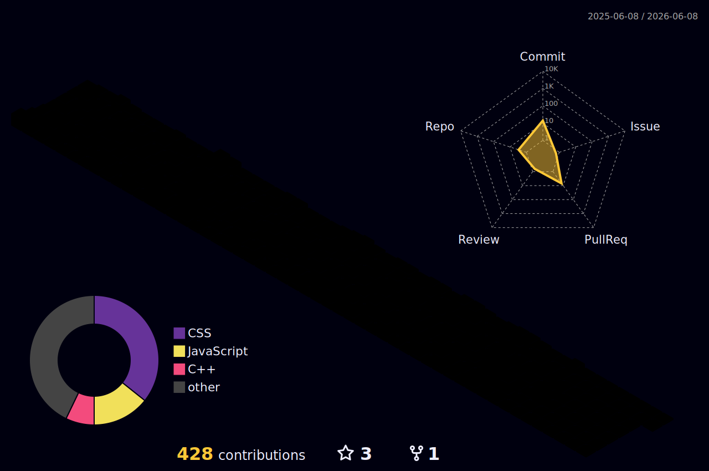

<h1 align="center">Hi 👋, I'm Avishek Das</h1>

  

  

---

## 👨‍💻 About Me

- 🎓 B.Tech in Computer Science Engineering  
- 💻 Focused on **Java Backend Development, Scalable Systems & Data Science**
- 🌱 Currently learning **Spring Boot, Machine Learning, System Design**
- 🚀 Building real-world public projects
- 📫 Reach me at **avishek.das7384@gmail.com**
- ⚡ Fun fact: I debug faster after coffee ☕

  

---

## 🌐 Connect With Me

---

## 🛠️ Tech Stack

### Languages

### Backend / Database

### DevOps / Tools

### Creative / Extra

---

## 🌌 Contribution Graph

---

## 📈 GitHub Stats

---

## 🎯 Current Goals

- Master Java + Spring Boot
- Build resume-grade public projects
- Grow into Data Science / AI
- Crack elite opportunities

---

⭐ Thanks for visiting my profile!

